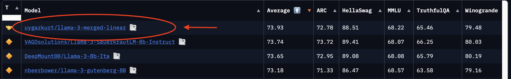
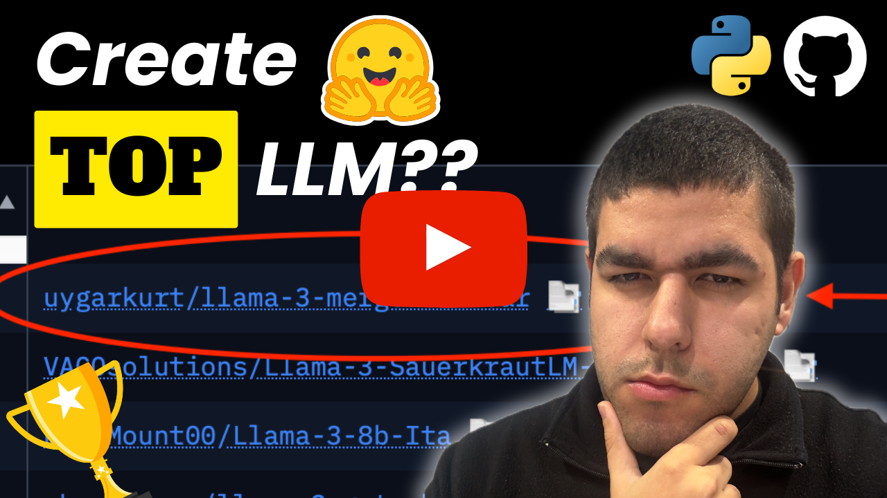

# LLM Model Merging

    
    

    

 

    
Liked our work? give us a ⭐!

  

This repository contains the notebook and sample `yml` file for linear model mergind.

In this specific case, I typed `llama-3` into the open LLM leaderboard, took the best 3 models, merged them and created
a better ranking model wihtout any training.

As the main libraries we will be using [mergekit](https://github.com/arcee-ai/mergekit).

## YouTube Tutorial

    <a href="https://youtu.be/gNXBp3wttFU">Model Merging: Merge LLMs to Create Frankestein Models - Python, HuggingFace, Mergekit</a>
     
     
    

